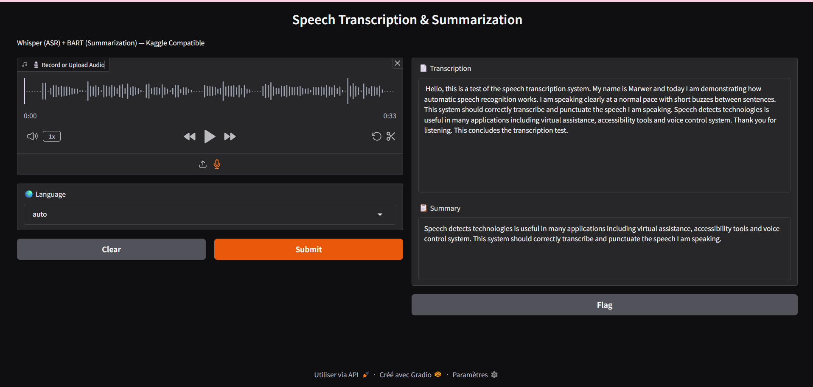

# Speech Transcription & Summarization

A Python-based pipeline for speech-to-text transcription and automatic summarization of audio files using state-of-the-art models. This project features a user-friendly Gradio interface for easy testing and demonstration.

## Features

Transcribe audio files (microphone or uploaded) in multiple languages.

Automatically summarize long transcriptions into concise text.

Simple and intuitive web interface powered by Gradio.

Modular structure for easy extension to other NLP tasks.

## Technologies & Libraries

- Python
- Automatic Speech Recognition (ASR)
- Summarization using pre-trained transformer models
- Gradio for web interface

## How It Works

Audio Input: Users can upload an audio file or record directly via microphone.

Transcription: The audio is converted into text using a speech recognition model.

Summarization: The transcription is processed to produce a concise summary.

Output: Both the full transcription and the summary are displayed side by side.

## Usage

Clone the repository

Install dependencies

Launch the interface

Record or upload audio to see transcription and summary results

## Demonstration:

Here is how the transcription and summarization pipeline works:

## Limitations & Notes

Summarization is primarily English-focused. Non-English audio may require translation.

Long audio may be truncated for faster processing.

## Future Improvements

Add multilingual summarization using mBART or T5.

Enable chunking of long audio for complete summarization.

Real-time streaming transcription and summary updates.

Deploy on Hugging Face Spaces for public access.
